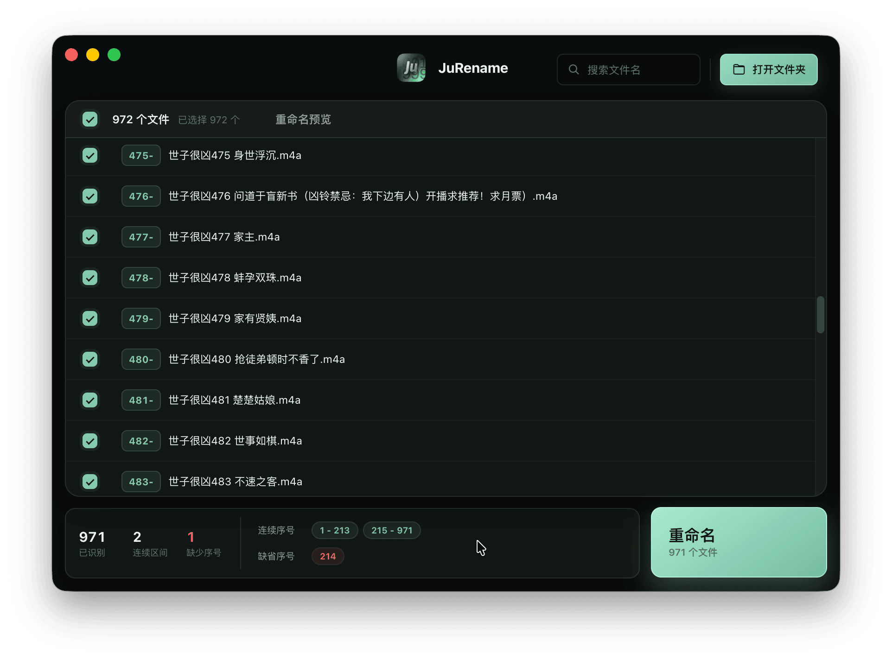

# JuRename | 序号识别重命名


智能识别剧集文件名中的**集数序号**，在文件名**开头补零**重命名，让各类播放器按正确顺序播放。


- 主页：[https://qzrzz.github.io/JuRename/](https://qzrzz.github.io/JuRename/)
- 下载：[https://github.com/qzrzz/JuRename/releases](https://github.com/qzrzz/JuRename/releases)
  
## 为什么需要这个

JuRename 它解决的问题的背景是我有很多剧集文件，在手机播放器上顺序是不对的，因为
它们文件名中的序号出现位置不是严格的格式，所以需要找出正确的序号重命名。

有序号但是乱七八糟的文件名：

```shell
A剧略略略-01.m4a
A剧略 2021 略 7 略-02.m4a
特殊A剧略略略 3.m4a
A剧咯咯咯-4 (2).m4a
```

识别到正确序号，添加到开头：

```shell
01-A剧略略略-01.m4a
02-A剧略 2021 略 7 略-02.m4a
03-特殊A剧略略略 3.m4a
04-A剧咯咯咯-4 (2).m4a
```

这年头批量重命名让 AI Agent 完成不就行了吗？其实还是不太行，首先就是速度慢，让
Agent 读 Nas 上的大量文件并且识别序号实在是太慢了，并且其实不太稳定，有可能会出错，
万一出错就麻烦了，所以最佳方案是让 AI Agent 生成一个 App，调教好规则和流程下次用
App 来操作才是更好的方案。



## 功能

- 拖拽文件 / 文件夹到窗口，或通过按钮选择
- 智能提取集数（区分年份、分辨率等干扰数字）
- 预览新旧文件名，可勾选、可调补零位数与分隔符
- 一键批量重命名（不可撤销，请先确认预览）

## Vibe Coding

这是用 Vibe Coding 实现的工具，使用 Codex GPT 5.6 sol/terra

```md
## 实现

使用 base-ui
使用 vite
使用 Renderaissance 设计样式，黑暗模式为主色调
使用 electron-builder
使用 TypeScript

核心逻辑、前端界面、操作系统功能要分开，有良好的代码结构

## 界面

拖拽文件可以添加到界面中

有一个主的文件列表，文件列表按序号排序

文件列表要是虚拟列表

只显示新文件名（因为新文件名只是序号+间隔符+旧名字）
新文件名中序号要高亮

要可以输入关键词在文件名中滚动

列表中如果有序号是断开的，会插入一个展示行，用来表示序号断开，并且显示「缺少 n - m （length）」

在文件列表下有一个序号信息栏，显示：「连续序号」「缺省序号」
，序列要可以点击然后滚动定位到附近

有一个大大的重命名按钮

### 序号逻辑

总体目标：

- 为所有文件分配序号，让文件名按节目序号排列
- 不需要语义的识别（也就是不用管“集”,"EP"等关键词），识别的重点是连续数字

已知逻辑：

- 序号是唯一的
- 文件名中包含序号
- 文件数大概率是序号总数

总体流程：

- 得到文件数作为可能的序号总数
- 从文件名中提取全部可能的数字（包括大写中文）
  - 每个文件名的序号们有一个置信度，根据规则增减置信度，最后取最大作为序号
    - 负面规则：
      - 重复数字，如果某些数字重复出自在文件名中，它不可能是序数，30% 的重复率就触发，重复率越高置信度削减越大
    - 正面规则：
      - 连续数字，维护连续数字序列，在全部文件数字中找有没有上一个或者下一个，如果有就加入一个连续序列（序列如果相连会合并），全部数字都遍历往后，再回头看每个数字是否在某个连续序列中，而连续序列是有长度的，根据长度排序给以很大的置信度

- 最后看每个文件是否有重复的序号，然后检查是否有 n.n 的同序号文件名，要支持 n.n，如果 001.1 和 001. 注意着要在原文件名中看是否有 n.n 的规则，而不是把重复序号强行加.n
```

## 开发

### Electron 版本

项目使用 [Bun](https://bun.sh/) 管理依赖和运行脚本。

```bash
# 安装依赖
bun install

# 启动桌面应用开发环境
bun run start

# 运行测试
bun run test
```

### 构建桌面应用

```bash
# 构建桌面应用资源
bun run build

# 生成本机 macOS 发行包（会签名和公证）
bun run dist:mac
```

### 本地构建、签名与发布

先在“钥匙串访问”中安装 Apple Developer Program 的 `Developer ID Application` 证书，并确认系统能找到它：

```bash
security find-identity -p codesigning -v
```

在 `.env` 中设置签名与公证凭据。`APPLE_APP_SPECIFIC_PASSWORD` 是 Apple ID 的 App 专用密码，而不是登录密码：

```bash
MACOS_SIGNING_IDENTITY='Developer ID Application: Your Name (TEAMID)'
APPLE_ID='you@example.com'
APPLE_APP_SPECIFIC_PASSWORD='xxxx-xxxx-xxxx-xxxx'
APPLE_TEAM_ID='TEAMID'
```

构建三个平台的发行包：

```bash
bun run dist:all
```

该命令会在本机生成并签名、公证 macOS 的 DMG 与 ZIP；再通过 Docker 生成 Windows ZIP 和 Linux AppImage。产物位于 `release/`。

发布新版本会递增版本号、构建三个平台、推送 Git tag，并用已登录的 GitHub CLI 创建 Release 和上传全部产物：

```bash
gh auth login
bun run release

# 次版本或主版本
bun run release -- minor
bun run release -- major
```

如果已完成构建、只需要上传 `release/` 中的现有产物：

```bash
bun run release:publish
```

### 构建官网与 GitHub Pages

官网源文件位于 `website/`，使用 Vite 构建。构建产物会生成到 `docs/`，该目录可直接设为 GitHub Pages 的发布目录。

```bash
# 启动官网本地开发服务器
bun run website:dev

# 生成 GitHub Pages 静态文件到 docs/
bun run website:build
```

在 GitHub 仓库的 Pages 设置中，选择从当前分支的 `/docs` 目录部署即可。

### 发布 GitHub Release

发布流程会根据 `package.json` 的 `version`，构建 macOS、Windows 和 Linux 的安装包，再将全部产物发布到同名的 GitHub Release。

工作区处于干净状态后，运行以下命令即可完成版本递增、官网构建、三平台构建、Git 提交、打标签、推送与 GitHub Release 发布：

```bash
# 补丁版本：1.0.0 → 1.0.1
bun run release

# 次版本：1.0.0 → 1.1.0
bun run release -- minor

# 主版本：1.0.0 → 2.0.0
bun run release -- major
```

脚本会创建 `v` 加版本号的标签（例如 `v1.1.0`），并显式将当前分支与该标签推送到远程仓库。GitHub Actions 随后验证标签与 `package.json` 版本一致，再构建和发布。
